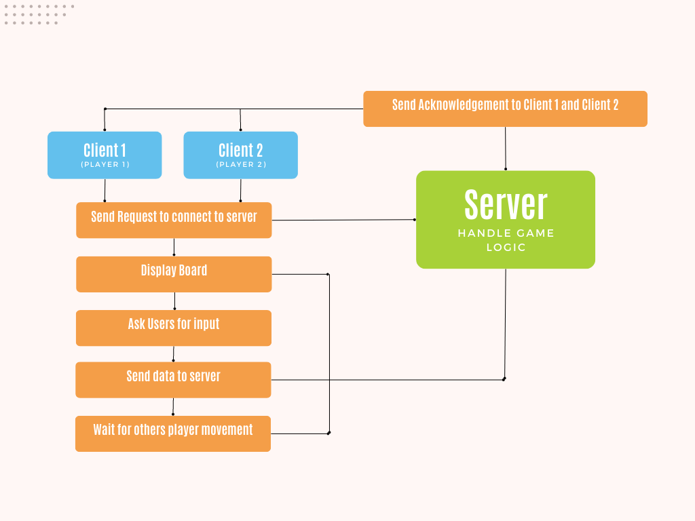

# LAN Tic-Tac-Toe Game

### Game Description

- The project is a C# console-based Tic Tac Toe game with a client-server architecture. The game allows two players to play against each other, with both players acting as clients that connect to a local server.

- The server-side code includes the main functionality of the game, such as accepting connections, starting the game, receiving and processing moves from the client, and sending game data back to the client. The server side uses the TcpListener class to listen for incoming client connections and the NetworkStream class to read and write data.

- The client-side code includes a separate console application that connects to the server using the TcpClient class. Once the connection is established, the client receives the initial game data from the server, displays the game board, and prompts the user to enter their move. The client then sends the move to the server and waits for the updated game data to be sent back.

- The game is played by entering row and column numbers to indicate where the player wants to place their mark. The game board is displayed as a 3x3 grid with each square being labeled with its corresponding row and column number. The first player to get three in a row (horizontally, vertically, or diagonally) wins the game.

### How to execute the game
 1. Clone this repo
 2. Open the Server Folder and Run it.
 3. Open two new Console Instances, open and run the Client Folder in each Console Instance. Each Console is a Player. Once the two players connect, the game will start.
 4. Once the clients are connected to the server, the game will start automatically. The server will wait for the first move from the client, and the client will wait for the other clients response before making its next move.
 5. The game ends when either one of the clients wins, or when the game is a draw.

 Note: The default IP address used in the server code is "127.0.0.1", which is the loopback address. If you want to connect to the server from a different machine, you need to replace this IP address with the IP address of the server machine. Also, make sure that the firewall is not blocking the incoming connections to the server.

 ## Class Report
 
- Initially, I had an idea for my final project to be a Students Dorms Management System. However, I later changed my mind and decided to develop an Online Tic-Tac-Toe Game. While working on the project, I realized that in order to make it truly online, where any computer in the world can connect to the server, I would require more time and resources. Therefore, I decided to develop the game locally, so that it works only when the server and clients are connected to the same network.

- This project is interesting to me because it allowed me to learn something new. I had never worked with TCP/IP connection before, and while working on this project, I was able to acquire new skills. I was looking for a challenge, and this project provided exactly that. Developing the Tic-Tac-Toe game itself was not the most difficult aspect of the project. The real challenge was in managing all the details related to the server and client-side interactions. Everything in the program had to happen in real-time, which meant I had to take various factors into consideration. For example, I had to determine how to handle incorrect requests, player disconnections, and incomplete data. I also had to manage the data being sent between the clients and server, identify which client was player 1 and player 2, and ensure the server would continue to run even if the game crashed. The most challenging aspect of this project was not the Tic-Tac-Toe game itself, but rather the server and client-side development.

- I have successfully implemented all the essential features and functionalities in the project as per my plan. However, I could not include some additional features that I wanted, such as a player versus computer mode due to time constraints. I intend to work on adding these extra features as a personal hobby in the future.

